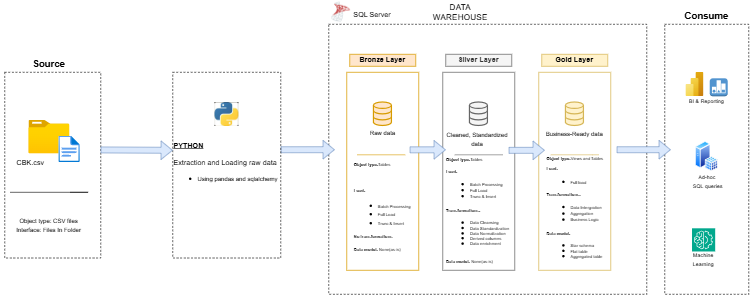

# CBK Kenya Economics Warehouse

A data warehouse project built on Kenya's central bank data — monthly currency exchange rates (back to 1993) and interest/policy rates (back to 1991), sourced from the Central Bank of Kenya (CBK). The goal was to take two messy real-world CSVs and turn them into a proper, query-ready warehouse using the medallion (Bronze → Silver → Gold) architecture, then dig into the data for some actual insights about Kenya's economic history.

Everything runs on Python + SQL Server (T-SQL).

## Why this project

Most "beginner portfolio" data projects use datasets that have been cleaned a thousand times before (Titanic, Iris, etc). This one uses raw CBK exports — decades of real government data, complete with typos, inconsistent formatting, blank cells, and a currency (JPY) quoted per 100 units instead of per 1. The point was to practice actually wrangling messy data end-to-end, not just running `df.describe()` on something tidy.

## Architecture



- **Source** — raw CBK CSVs (`datasets/`)
- **Bronze** — raw data loaded as-is (everything as NVARCHAR, no transformations) via Python
- **Silver** — cleaned and standardized: proper dates, typed numeric columns, fixed typos, consistent naming
- **Gold** — business-ready star schema: dimension tables + fact tables, plus wide-format views for easy querying

See `documents/data_flow_diagram.png` and `documents/data_mart(star schema).png` for more detail on how data moves through the layers and how the final star schema is laid out.

## Repo structure

```
datasets/               Raw CBK CSVs (exchange rates + interest rates)
documents/               Architecture, data flow, and star schema diagrams (.drawio + .png)
scripts/
  bronze/                Python scripts that load the raw CSVs into SQL Server
  silver/                Schema setup, DDL, and stored procedure for the Silver layer
  gold/                  DDL for dimension/fact tables, wide-format views, and the Gold load stored procedure
  checks/                Non-destructive data quality checks (nulls, duplicates, row counts, plausibility ranges)
  analysis/               Exploratory and deep-dive SQL analysis on the finished warehouse
```

## How the pipeline works

**1. Bronze (Python)**
`scripts/bronze/*.py` reads the raw CSVs with pandas and loads them straight into SQL Server using SQLAlchemy, with every column typed as NVARCHAR. No cleaning happens here — the point of Bronze is to keep an unaltered copy of the source data so nothing is ever lost or assumed too early.

**2. Silver (SQL)**
`scripts/silver/silver_ddl.sql` (also wrapped in a stored procedure in `silver_stored_proc.sql`) does the real cleanup:
- Builds a real `date` column from separate Year/Month fields
- Renames currency columns to proper ISO codes (USD, GBP, EUR, etc.)
- Casts everything to `FLOAT` using `TRY_CAST`, so bad/blank values become NULL instead of breaking the load
- Normalizes JPY from a per-100-yen quote to per-1-yen, so it's comparable with the other currencies
- Fixes a "Sept" vs "Sep" typo in the interest rates data
- Forward-fills the Year column in the interest rates table, which was only populated on the first row of each year in the source file

**3. Gold (SQL)**
`scripts/gold/` builds a star schema on top of Silver:
- `dim_dates`, `dim_currencies`, `dim_rates` — dimension tables (currencies and rate types are hand-curated, including flags for currencies that were retired after the Euro was introduced in 1999)
- `fact_exchange_rates` and `fact_interest_rates` — long-format fact tables, unpivoted from the wide Silver tables so the grain is one row per date/currency (or date/rate-type)
- `exchange_rates_wide` and `interest_rates_wide` — views that pivot the fact tables back into wide format for people who'd rather see one row per month with all currencies as columns

The whole Gold load is wrapped in `gold_stored_proc.sql`, which drops and rebuilds every table in order with timing logs for each step.

**4. Checks**
`scripts/checks/` has SELECT-only validation queries for the Silver tables — checking for null dates, duplicate dates, row counts against Bronze, and whether values fall in a plausible range. Nothing here modifies data; it's just sanity-checking the pipeline.

**5. Analysis**
`scripts/analysis/` is where the warehouse actually gets used. A few of the findings:
- INR came out as the most statistically stable currency against KES over the full ~30 year period (measured by coefficient of variation)
- KES/USD moved from about 36 in January 1993 to about 160 by January 2024 — roughly 4.25% average annual depreciation, compounded
- The interest rate data flags April–December 1993 as a clear anomaly (rates more than 2 standard deviations above the historical average), which lines up with Kenya's real 1993 financial crisis
- The 1990s decade shows both the highest average interest rates and the most internal volatility of any decade in the dataset

## Running it yourself

1. Load the two CSVs from `datasets/` into a local SQL Server instance using the scripts in `scripts/bronze/` (you'll need `pandas`, `sqlalchemy`, and an ODBC driver for SQL Server — update the connection string in each script to match your setup)
2. Run `scripts/silver/00_schema_setup.sql` to create the `silver` and `gold` schemas
3. Run `scripts/silver/silver_ddl.sql` (or call `silver.silver_load`) to build the Silver tables
4. Run the DDLs in `scripts/gold/`, or call `gold.gold_load`, to build the star schema
5. Run anything in `scripts/checks/` to confirm everything loaded cleanly
6. Explore `scripts/analysis/` for the deeper queries, or write your own against `gold.exchange_rates_wide` / `gold.interest_rates_wide`

## Notes / limitations

- Both source CSVs are static snapshots downloaded manually from the CBK website (which blocks automated scraping) and stop around 2024 — this isn't a live-updating pipeline
- A few currencies (Deutsche Mark, French Franc, Italian Lira, etc.) stop appearing in the data after 1998 since they were replaced by the Euro — this is reflected in `dim_currencies` via `is_active` / `retired_year` rather than treated as missing data
- Some deeper analysis (like triangulating whether every currency spiked simultaneously in 1993, to separate a KES-specific shock from a global one) was deliberately left out to keep the analysis scripts focused — left as an exercise for anyone digging further into the data

## 🛡️ License

This project is licensed under the [MIT License](LICENSE). You are free to use, modify, and share this project with proper attribution.

## About Me
Hi there, I'm Mohamed Habib, a young programming enthusiast trying to make something of their life, InshaAllah I will succeed✌️.

### Connect with me
[](https://substack.com/@moha0ll)

